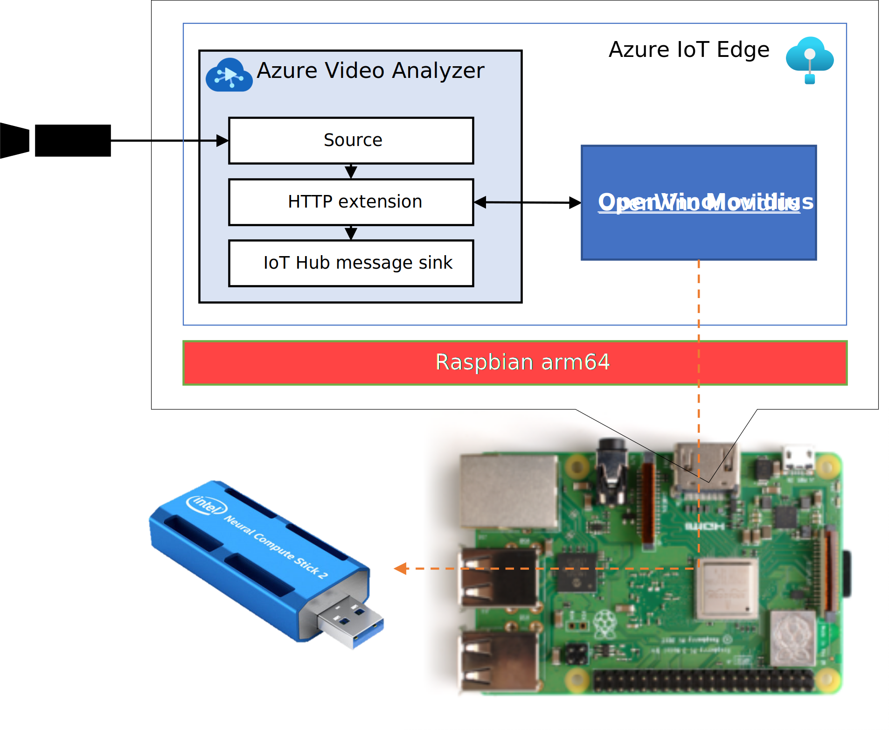

# build-and-run-video-analyzer-with-mobidius-on-raspberrypi
This site describes how to run Video Analyzer on Edge on Raspberry Pi 3+ with Intel Movidius and how to build IoT Edge module (Docker Image) using OpenVino with Myriad device

## Motivation
On the lowwer cost hardware as possible, I'd like to use OpenVino pre-trained AI model in Azure Video Analyzer pipeline.  
To achieve this, I selected Raspberry Pi 3+, 4 and INTEL Movidius, which are most familier gadgets for Geek.  



## How to build Docker image  
1. Setup Raspberry Pi. The OS used for installation can be either Raspbian Arm 32 or Arm 64.  
1. Set swap size as large as possible. - https://www.bitpi.co/2015/02/11/how-to-change-raspberry-pis-swapfile-size-on-rasbian/ 
1. Install Docker engine.
```sh
curl -sSL get.docker.com | sh && sudo usermod pi -aG docker && sudo reboot
```
4. Clone this repository on your Raspberry Pi shell and build Docker image.
```sh
git clone https://github.com/ms-iotkithol-jp/build-and-run-video-analyzer-with-mobidius-on-raspberrypi.git
cd EdgeSolution/modules/openvinomovidius
sudo docker -t openvinomovidius -f Dockerfile.arm32v7 .
```
5. Tag your buit image and push it to your repository. the repository can be either Azure Container Registry or Docker Hub.  
```sh
sudo docker tag openvinomovidius yourrepository/openvinomovidius:version
sudo docker push yourrepository/openvinomovidius:version
```
'<i>version</i>' may be decided accordingly.  
This build takes too long time, so please be willing wait. ;-)

---
## How to use  
### Preparation  
Running openvinomovidius module Raspberry Pi must install Raspbian Arm64 because there is no Azure Video Analyzer on Edge Docker image for Arm32.  
You can get Raspbian Arm64 image from http://downloads.raspberrypi.org/raspios_arm64/images/ .  
If you are not familier for Azure Video Analyzer on Edge, please refere https://docs.microsoft.com/azure/azure-video-analyzer/video-analyzer-docs/overview .   
Before deploy openvinomovidius module, setup Azure IoT Edge and Azure Video Analyzer on Edge according to https://docs.microsoft.com/azure/azure-video-analyzer/video-analyzer-docs/get-started-detect-motion-emit-events-portal .
Then, don't forget to insert Movidius Stick into Raspberry Pi USB port.  

### AI Model 
The AI model of <b>OpenVino Movidius</b> module is replacable. You can specify which model is used via Module Twins Desired Properties.  
AI models can be download from OpenVino sites. Please refer https://docs.openvinotoolkit.org/latest/openvino_docs_install_guides_installing_openvino_raspbian.html for how to download.  
To specify an AI model for this module, it is first necessary to create a file that compresses the AI model in TGZ format and store it in a downloadable location (for example, Azure Blob Storage) on the Internet.
When AI model is 'face-detection-adas-0001.xml', the way to make tgz file is as follows.  
```
tar cvzf model.tgz face-detection-adas-0001.xml face-detection-adas-0001.bin face-detection-adas-0001-label.txt
```

### Deploy <b>openvinomovidius</b> module  
On the Azure Portal, specify module deployment settings.

<b><u>Image URI</u></b>:  
yourrepository/openvinomovidius:version 

<b><u>Container Create Options</u></b> :  
```json
{
  "NetworkingConfig": {
    "EndpointsConfig": {
      "host": {}
    }
  },
  "HostConfig": {
    "Binds": [
      "/dev:/dev"
    ],
    "Privileged": true,
    "PortBindings": {
      "8888/tcp": [
        {
          "HostPort": "8888"
        }
      ]
    },
    "NetworkMode": "host",
    "ExposedPorts": {
      "8888/tcp": {}
    }
  }
}
```

<b><u>Module Twins Desired Properties</u></b>:  
```json
{
  "model": {
    "url": "<- url of model.tgz ->",
    "filename": "model.tgz",
    "name": "face-detection-adas-0001.xml",
    "label": "face-detection-adas-0001-label.txt"
  },
  "send-telemetry": true | false
}
```
When you specify "send-telemetry" property as true, this module send telemetry of scored results at each frame processing.


<b><u>Optional</u></b>:
OpenVino Movidius module also can upload image detect something to Azure Blob Storage with Blob on Edge deployment by adding ENVIRONMENT VARIABLEs.  
Please refere https://docs.microsoft.com/azure/iot-edge/how-to-store-data-blob?view=iotedge-2020-11 and setup Azure Blob on Edge for your Raspberry Pi IoT Edge.  

|Environment Variable Name| Value|
|-|-|
|BLOB_ON_EDGE_MODULE| name of the deployed 'Blob on Edge' module|
|BLOB_ON_EDGE_ACCOUNT_NAME|local account name specifyed in 'Blob on Edge' module|
|BLOB_ON_EDGE_ACCOUNT_KEY|local account key specifyed in 'Blob on Edge' module|
|BLOB_CONTAINER_NAME|container name specifyed in 'Blob on Edge' module|

When above environment variables are set, you can add following settings in module twin desired properties.
```json
{
  "upload": {
    "interval-sec": 60,
    "inference-mark": true | false
  }
}
```
To prevent frequent image uploads to blob container, you can set to upload image only when detected after seconds specified by  "interval-sec".  
When you specify "inference-mark" as true, image marked with detected locations is uploaded.
